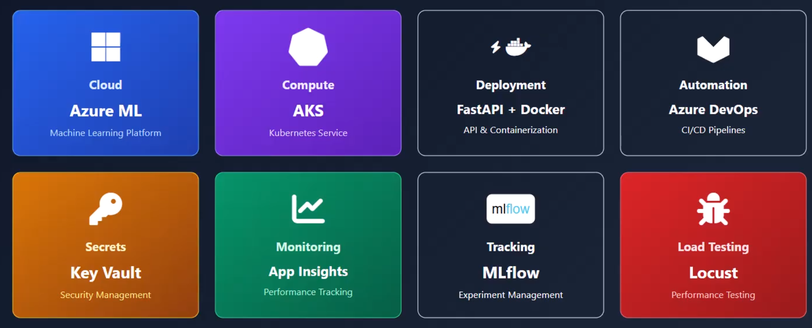
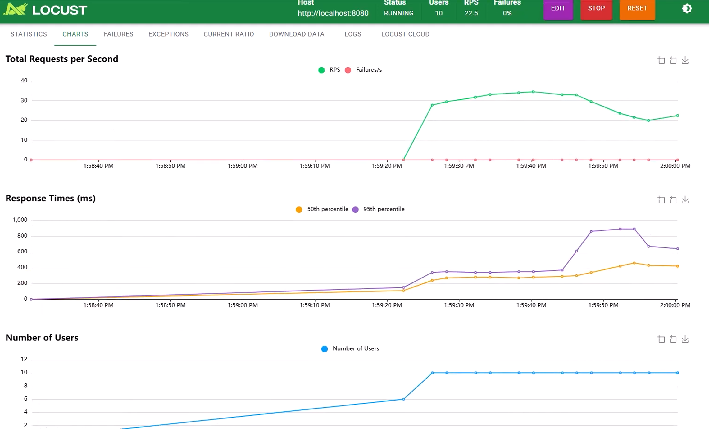

# Perceptra

A production‑ready AI/ML MLOps boilerplate integrating **Azure ML**, **AKS**, **FastAPI**, **Docker**, **Azure DevOps**, **Key Vault**, **App Insights**, **MLflow**, and **Locust** for end‑to‑end experimentation, deployment, and monitoring.



---

## 🚀 Overview

**Perceptra** is an enterprise‑grade template for building, deploying, and scaling machine learning applications on Azure’s cloud ecosystem. It standardizes the workflow from data ingestion to inference, including CI/CD, secrets management, observability, and model lifecycle tracking.

### 🔧 Tech Stack Summary

| Layer               | Tool                               | Purpose                                                   |
| :------------------ | :--------------------------------- | :-------------------------------------------------------- |
| ☁️ **Cloud**        | **Azure ML**                       | Machine learning compute, pipelines, and model registry   |
| ⚙️ **Compute**      | **AKS (Azure Kubernetes Service)** | Container orchestration and scalable deployment           |
| 🐳 **Deployment**   | **FastAPI + Docker**               | API serving and containerization                          |
| ⚡ **Automation**    | **Azure DevOps**                   | CI/CD pipelines for training & deployment                 |
| 🔑 **Secrets**      | **Azure Key Vault**                | Secret, credential, and key management                    |
| 📊 **Monitoring**   | **Azure App Insights**             | Application telemetry & performance monitoring            |
| 🧪 **Tracking**     | **MLflow**                         | Experiment tracking and model versioning                  |
| 🐞 **Load Testing** | **Locust**                         | Load testing for API latency, throughput, and scalability |

---

## 🧩 Repository Structure

```
azure_components/   # Azure resource helpers (Key Vault, Identity, ML SDK clients)
deployment/         # Deployment scripts and manifests (Docker/K8s)
devops/             # Azure DevOps CI/CD pipeline YAML definitions
docker/             # Dockerfiles and container build context
environment/        # Environment configuration files (.env per environment)
integration/        # Service integration scripts and SDK adapters
jobs/               # Batch jobs, data prep, and cron schedulers
k8s/                # Kubernetes manifests (Deployments, Services, Ingress)
keyvault/           # Key Vault sync utilities for secrets
load_testing/       # Locust scripts, reports, and configuration files
monitoring/         # App Insights setup and dashboard JSONs
pipelines/          # MLflow & AzureML pipelines for training and scoring
requirements/       # Exported dependencies if not using Poetry
src/                # Application source code (FastAPI app, utils, models)
tests/              # Unit and integration tests
main.py             # Entry point for API or CLI
pyproject.toml      # Poetry project metadata and dependencies
```

---

## ⚙️ Setup Instructions

### 1️⃣ Prerequisites

* Python 3.10+
* [Poetry](https://python-poetry.org/)
* Docker Desktop (with Kubernetes enabled)
* Azure CLI & Azure ML CLI extension
* MLflow (for local experiment tracking)

### 2️⃣ Local Environment Setup

```bash
git clone https://github.com/smaliaquib/Perceptra
cd Perceptra
poetry install
cp environment/sample.env .env
poetry run pytest -q
poetry run python main.py
```

---

## 🔐 Secrets Management with Key Vault

Use Azure Key Vault for storing and retrieving sensitive data like DB credentials, API keys, and connection strings.

Example:

```python
from azure.keyvault.secrets import SecretClient
from azure.identity import DefaultAzureCredential

vault_url = f"https://{os.getenv('AZURE_KEY_VAULT_NAME')}.vault.azure.net"
client = SecretClient(vault_url=vault_url, credential=DefaultAzureCredential())
secret_value = client.get_secret("DBConnectionString").value
```

Add your vault reference to `.env`:

```
AZURE_KEY_VAULT_NAME=perceptra-vault
AZURE_CLIENT_ID=<client-id>
AZURE_TENANT_ID=<tenant-id>
AZURE_CLIENT_SECRET=<client-secret>
```

---

## 🧠 MLflow Tracking & Model Management

Track experiments, parameters, metrics, and artifacts using MLflow.

### Start a local MLflow Tracking Server

```bash
mlflow server \
  --host 127.0.0.1 --port 5000 \
  --backend-store-uri sqlite:///mlruns.db \
  --default-artifact-root ./mlruns
```

Add to `.env`:

```
MLFLOW_TRACKING_URI=http://127.0.0.1:5000
MLFLOW_EXPERIMENT_NAME=perceptra-exp
```

### Log experiments

```python
import mlflow

mlflow.set_experiment("perceptra-exp")
with mlflow.start_run(run_name="baseline"):
    mlflow.log_param("model", "xgboost")
    mlflow.log_metric("rmse", 0.231)
    mlflow.log_artifact("models/best_model.pkl")
```

### Register models to Azure ML Registry

MLflow models can be directly registered to Azure ML via the CLI or SDK:

```bash
az ml model register -n perceptra-model -p ./mlruns/0/<run_id>/artifacts/model
```

---

## ☸️ Deployment on AKS

Use provided manifests under `k8s/` for deploying APIs or batch jobs.

```bash
kubectl apply -f k8s/deployment.yaml
kubectl apply -f k8s/service.yaml
kubectl apply -f k8s/ingress.yaml
```

> Azure DevOps pipelines automatically trigger deployment to AKS upon new Docker image push.

---

## 📈 Monitoring with App Insights

* Integrated telemetry logs using `opencensus-ext-azure`.
* Automatically captures FastAPI requests, dependencies, and exceptions.
* Dashboards and metrics templates are provided under `monitoring/`.

---

## 🧨 Load Testing with Locust

Use **Locust** to simulate user traffic, monitor RPS, and latency performance.

Example command:

```bash
locust -f load_testing/locustfile.py --host http://localhost:8000
```

### Locust UI Output



Analyze:

* Total requests per second (RPS)
* Response time percentiles
* Active user concurrency

---

## 🔁 CI/CD Pipeline

Azure DevOps handles:

1. **Build** – Linting, tests, and Docker build.
2. **Train** – Trigger MLflow experiments.
3. **Evaluate** – Compare new metrics with production baselines.
4. **Register** – Register new models if performance improves.
5. **Deploy** – Update AKS services via Helm/K8s manifests.

---

## 📦 Docker

```bash
docker build -t perceptra:local -f docker/Dockerfile .
docker run --rm -p 8000:8000 --env-file .env perceptra:local
```

---

## 🤝 Contribution Guidelines

1. Fork & clone repo
2. Create feature branch
3. Commit small, atomic changes
4. Include tests and update docs
5. Submit PR for review

---

## 🧭 Roadmap

* [ ] Integrate Ray or Azure Batch for distributed training
* [ ] Implement model drift monitoring with Evidently AI
* [ ] Add Prometheus + Grafana stack for enhanced metrics
* [ ] Add Canary deployment support
* [ ] Extend CI/CD for multi‑environment promotion

---

## 📜 License

MIT License © 2025 Aquib Ali Khan
